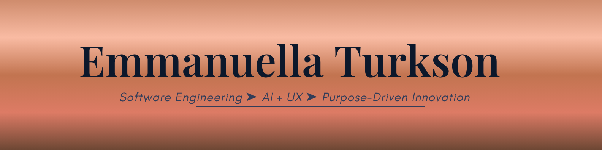

  

## 👋 Hi, I'm Emmanuella

<h3 align="center">Computer Science • AI • Systems • UI/UX</h3>

I enjoy building thoughtful technology, exploring artificial intelligence, and designing products that make life easier for people.

---

# 👩🏽‍💻 About Me

🎓 Computer Science student at Philander Smith University  

💻 Interned at Dell Technologies  

🔬 Conducted AI model evaluation and security analysis at Lawrence Berkeley National Laboratory  

🤖 Interested in Artificial Intelligence, systems engineering, and developer tools  

🎨 Passionate about UI/UX and designing intuitive digital experiences  

🌍 Founder of Save Our World, an initiative focused on serving underrepresented communities  

➗ I enjoy math, problem solving, and building meaningful technology  

---

# 🛠 Tech Stack

### Languages

---

### Tools & Frameworks

---
# 🌐 Connect With Me

---

# 🚀 Featured Work

### 🤖 AI Command Injection Detection

Evaluated large language models to analyze CLI outputs and detect command injection vulnerabilities.

Focus areas

• AI model evaluation  
• security analysis  
• CLI output interpretation  

---

### 🎨 Product & UX Experiments

Redesigning everyday digital products to improve usability, accessibility, and clarity.

Focus areas

• user research  
• interface design  
• product thinking  

---

### 🌍 Save Our World

A community initiative focused on building relationships and serving underrepresented communities through mentorship, outreach, and service projects.

---

# 📊 GitHub Stats

---

# 📈 GitHub Activity

---

# 🌱 Currently Learning

Artificial Intelligence systems  

Large Language Model evaluation  

Scalable backend systems  

Product design and UX strategy

---

# 🏆 Highlights

Dell Technologies Intern  

Lawrence Berkeley National Laboratory AI Research  Intern

Splunk HBCU Academic Scholar  

ColorStack Scholar

---

# 💡 Random Dev Quote

---

# 👀 Profile Views

---

⭐ From Emmanuella Turkson

➤ Made with clarity & purpose

